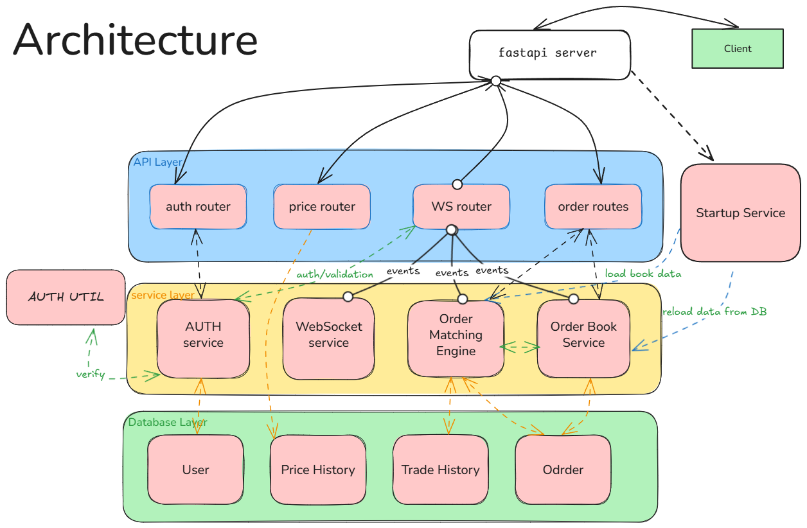

# realtime-trading-platform

## 🚀 Setup Instructions

### 1. Clone the Repository

```sh
git clone https://github.com/your-username/realtime-trading-platform.git
cd realtime-trading-platform
```

### 2. Configure Environment Variables

Copy the example environment files and update them as needed:

```sh
cp frontend/.env.sample frontend/.env
# If backend/.env.sample exists:
cp backend/.env.sample backend/.env
# Otherwise, create backend/.env and set required variables
```

Edit the `.env` files to match your local or production configuration.

### 3. Start the Application

Build and run all services using Docker Compose:

```sh
docker compose up -d --build
```

### 4. Access the Application

- **Frontend:** [http://localhost:5173](http://localhost:5173)
- **Backend API:** [http://localhost:8000/api/v1](http://localhost:8000/api/v1)

---

## 🧪 Test Coverage Report

| Name                                         | Stmts | Miss | Cover |
|---------------------------------------------- | -----:| ----:| -----:|
| app/api/__init__.py                          |     0 |    0 |  100% |
| app/api/routers/__init__.py                  |     0 |    0 |  100% |
| app/api/routers/auth_routers.py              |    26 |    4 |   85% |
| app/api/routers/order_routers.py             |    60 |    8 |   87% |
| app/api/routers/price_routers.py             |    11 |    0 |  100% |
| app/api/routers/ws_router.py                 |    41 |   31 |   24% |
| app/api/services/__init__.py                 |     0 |    0 |  100% |
| app/api/services/auth_service.py             |    31 |    3 |   90% |
| app/api/services/order_book_service.py       |   130 |    7 |   95% |
| app/api/services/order_matching_service.py   |   202 |    9 |   96% |
| app/api/services/startup_service.py          |    18 |    0 |  100% |
| app/api/services/ws_service.py               |    67 |    1 |   99% |
| app/config.py                                |     9 |    0 |  100% |
| app/core/__init__.py                         |     0 |    0 |  100% |
| app/core/auth_dependencies.py                |    25 |    0 |  100% |
| app/database/__init__.py                     |    14 |    1 |   93% |
| app/database/enums/__init__.py               |     0 |    0 |  100% |
| app/database/enums/oder_enums.py             |    12 |    0 |  100% |
| app/database/enums/user_enums.py             |     4 |    0 |  100% |
| app/database/models/__init__.py              |     2 |    0 |  100% |
| app/database/models/order_models.py          |    21 |    0 |  100% |
| app/database/models/price_models.py          |     8 |    0 |  100% |
| app/database/models/trade_models.py          |    18 |    0 |  100% |
| app/database/models/user_models.py           |    16 |    0 |  100% |
| app/schemas/__init__.py                      |     0 |    0 |  100% |
| app/schemas/auth_schemas.py                  |    27 |    5 |   81% |
| app/schemas/order_schemas.py                 |    37 |    2 |   95% |
| app/schemas/price_schemas.py                 |    11 |    0 |  100% |
| app/schemas/trade_scehmas.py                 |    15 |    0 |  100% |
| app/schemas/ws_schemas.py                    |    22 |    0 |  100% |
| app/server.py                                |    18 |    2 |   89% |
| app/util/__init__.py                         |     0 |    0 |  100% |
| app/util/auth_util.py                        |    25 |    0 |  100% |
| **TOTAL**                                    | **870**| **73**| **92%** |

---

## 🧪 Running Tests & Linting

1. **Navigate to backend:**
    ```sh
    cd backend
    ```

2. **Create a virtual environment and install dependencies:**
    - Use `pyproject.toml` or run:
      ```sh
      uv sync
      ```

3. **Run tests:**
    ```sh
    pytest
    ```

4. **Run linters:**
    - **flake8:**
      ```sh
      flake8 app test
      ```
    - **black:**
      ```sh
      black app test
      ```

---

## 🏗️ Architecture



---

## 🚀 Backend Scaling Strategy

### Concurrency Enhancement Approaches

#### 1. **Optimize Worker Configuration**
- Scale Gunicorn workers based on CPU cores (currently 5 workers)
- Increase worker connections for WebSocket handling
- Configure keepalive settings for persistent trading connections

#### 2. **Async Database Operations**
- Migrate from synchronous SQLAlchemy sessions to async operations
- Implement async connection pooling for better resource utilization
- Enable concurrent database operations for order processing

#### 3. **Connection Pooling with PgBouncer**
- Deploy PgBouncer or similar connection pooler

#### 4. **Message Queues for Order Processing**
- Implement message queues for order execution
- Queue order updates and trade notifications
- Use pub/sub pattern for real-time WebSocket broadcasting
